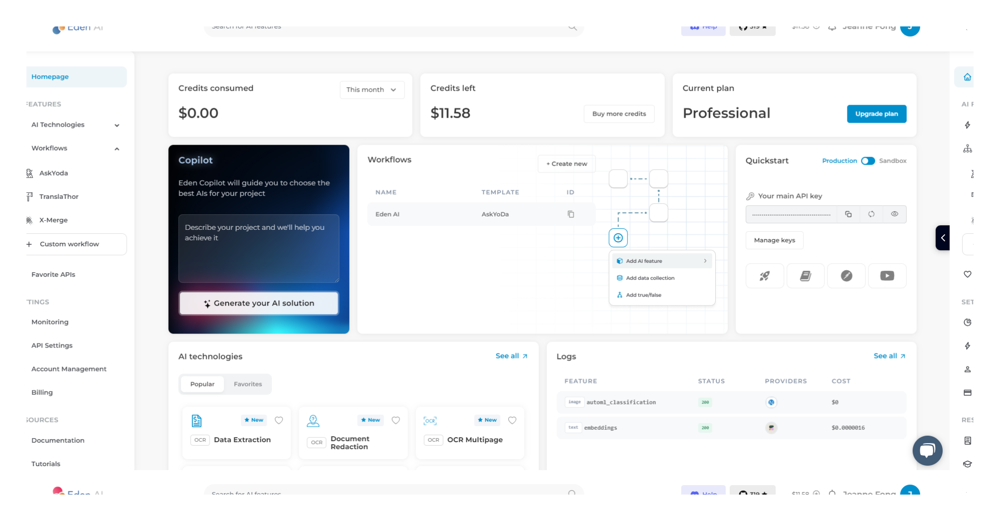
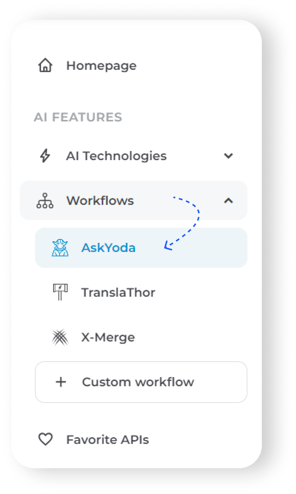
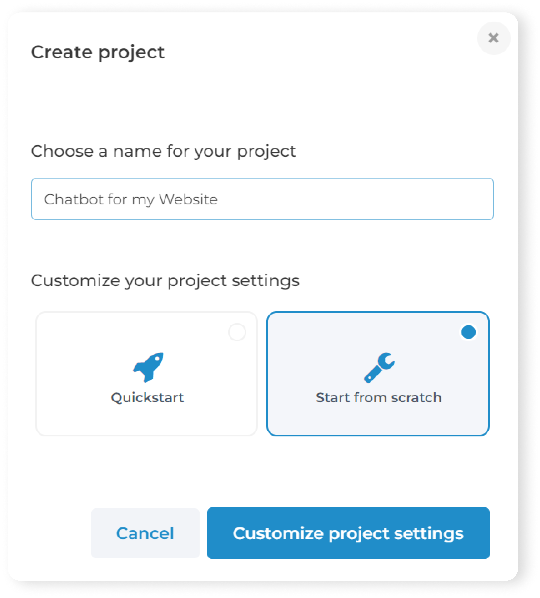
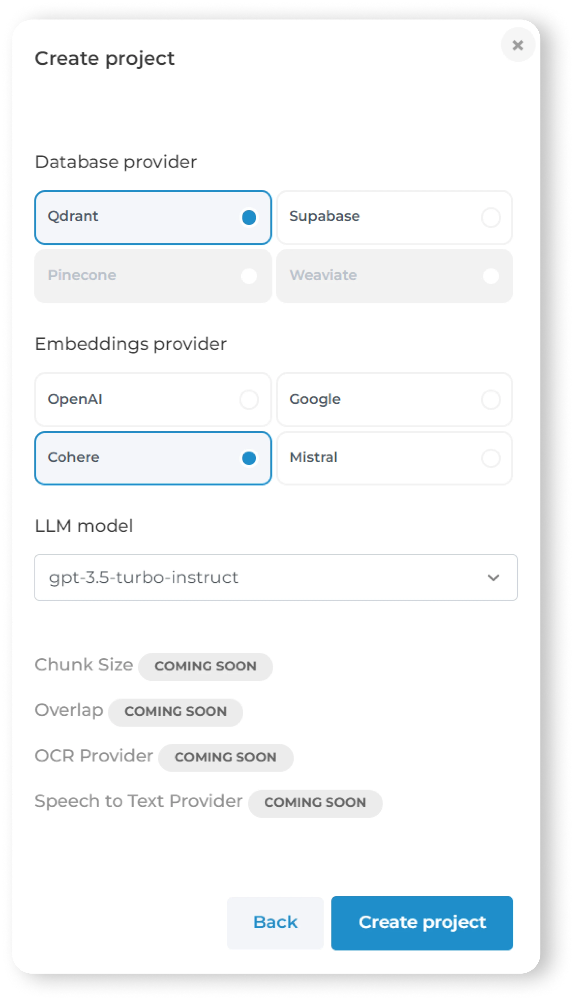
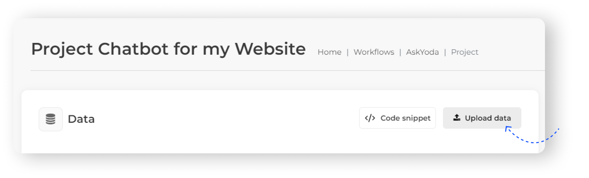
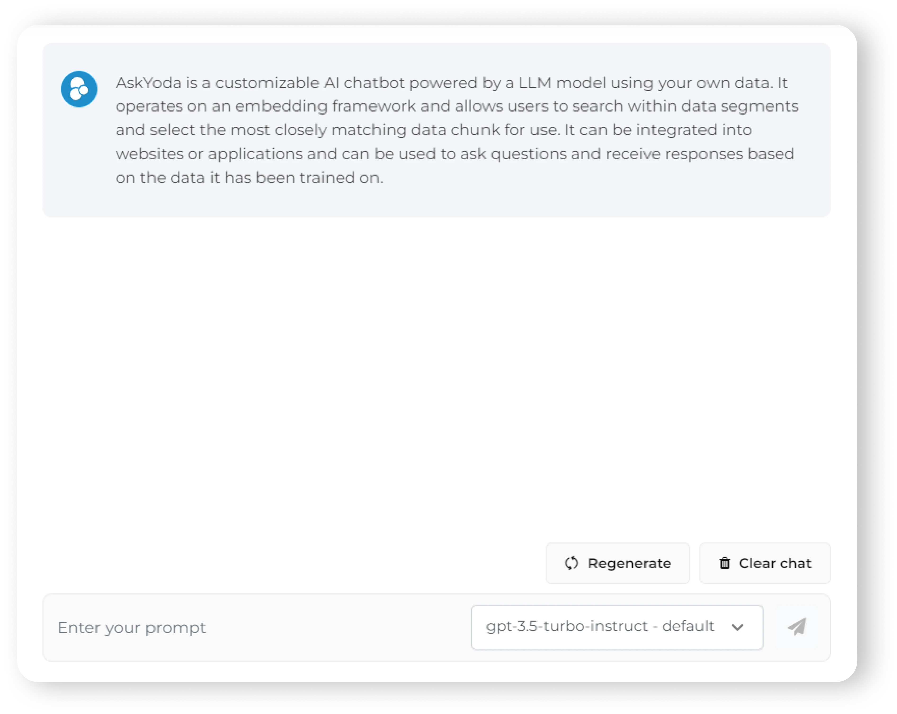

# Create a AskYoda Project

## Create an account on Eden AI for free

To begin utilizing Eden AI's AI Chatbot solution, the first step is to [create a free account on Eden AI](https://app.edenai.run/bricks/default). Once registered, you can obtain your API key 🔑 directly from the homepage. This key can then be used with the free credits provided by Eden AI.

## Train your Custom Chatbot on your own Data

Prior to deploying your chatbot, optimize its performance by training it with your tailored dataset for enhanced functionality.
To get started, in the Eden AI app, go to "Workflows" in the left sidebar to access Eden AI’s Custom Chatbot solution from the dropdown menu.

1. Click on "Create Project" and proceed to choose a name for your project.
Decide whether to begin with the "Quickstart" option or opt to "Start from Scratch." Selecting "Start from Scratch" grants you the flexibility to choose any option, which can be modified later.

With the start from scratch option, you have the flexibility to select your current database provider, your embedding provider from a selection that includes Open AI, Google, Cohere and your LLM model.
In the future, there will be additional choices available, such as adjusting the chunk size, overlap, selecting an OCR provider, and a speech-to-text provider.

2. After setting up your project, it's time to populate the database.
Click on "Upload Data" and choose the relevant data for your project. You can repeat this process as needed to ensure your dataset is comprehensive.

You can upload your data in the form of texts, URLs, PDFs, MP3, or WAV. The PDFs will be automatically parsed by OCR and the audio files will undergo speech-to-text conversion. There is also a code snippet available to add data.

‍
3. With your dataset in place, your custom chatbot is now tailored to your specific needs. You can immediately test its functionality and accuracy:

👏 Your custom chatbot is now ready. Let's explore how to import it!

## Now Click on the little button on the bottom right of the page
